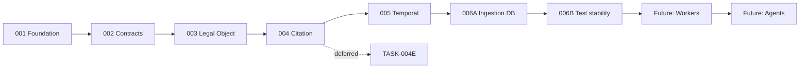

# Implementation Roadmap

**Authoritative implementation sequencing** (TASK-DOC-001).  
Statuses are **mutually exclusive** — each task appears in exactly one section.

For high-level status, see [CURRENT_STATUS.md](CURRENT_STATUS.md).  
For phase context, see [ARCHITECTURE_PHASE_MAP.md](ARCHITECTURE_PHASE_MAP.md).

**Last realigned:** 2026-06-01

---

## Sequencing correction: TASK-006B

| | |
|--|--|
| **Superseded (do not execute)** | Roadmap draft: *TASK-006B — Source Monitoring Agent Contract* |
| **Current approved TASK-006B** | **Test Isolation & Full-Suite Stability** |
| **Reason** | TASK-006A exposed migration/persistence complexity and **TEST-GAP-001** (full-suite instability). Test foundation must be trustworthy before agents, workers, or further migrations. |

Agent/monitoring contracts remain **FUTURE**, not current 006B.

---

## COMPLETE

Foundation and registry (TASK-001 and subtasks 001A–001P): runtime, models, migrations, CRUD, storage, upload, `ingestion_status` workflow, processing jobs, worker contract/no-op harness.

Extraction and structure contracts (TASK-002A–002F): extraction, segmentation, legal object extraction, citation anchors, cross-reference detection, structural parser.

Legal object path (TASK-002G–002I, 003A–003E): structural extraction, convergence, planning, schema, ORM, migration, repository, integrity.

Citation path (TASK-004A–004D, 004D-AMENDMENT-A): retrieval, effective-date resolver, citation candidates, citation assembly with version-pinned identity.

Temporal governance (TASK-005A-SPEC, 005B, 005C): `TEMPORAL_VERSIONING_ARCHITECTURE.md`, Addendum V6 alignment, pre-merge cleanup (005C).

Ingestion persistence (TASK-006A): `extraction_runs`, `extracted_texts`, `parser_runs`, `parsed_structures`, `ingestion_state_transitions`; `backend/app/services/ingestion/`; Alembic `c9a2f3b81d06`.

Documentation merge (TASK-005A merge governance): `MERGE_SUMMARY_TASK-005A.md`, checkpoint `checkpoint-task-005a-spec`.

---

## ACTIVE

| Task | Title | Notes |
|------|-------|-------|
| — | *(none in implementation)* | No code task in flight at doc realignment |

---

## APPROVED NEXT

| Task | Title | Prerequisite | Acceptance focus |
|------|-------|--------------|------------------|
| **TASK-006B** | Test Isolation & Full-Suite Stability | TEST-GAP-001 recorded | Full PostgreSQL suite reliable; integrity/retrieval tests isolated |

**Do not start** until TASK-006B is scoped/approved in a task spec (if required by governance).

**Blocked until 006B completes:** ingestion worker wiring, source monitoring agents, migration-heavy features without stable tests.

---

## DEFERRED

| Task | Title | Tracking | Trigger to un-defer |
|------|-------|----------|---------------------|
| **TASK-004E** | Citation Temporal Compliance Remediation | OD-016; [TASK-004E spec](TASKS/TASK-004E-CITATION-TEMPORAL-COMPLIANCE-REMEDIATION.md) | Blocks citation/temporal compliance work or explicit approval |

Non-task deferred items: OD-017 (003E reconciliation), OD-018 (overlap disclosure) — governance review, not implementation queue.

---

## FUTURE

Not approved for immediate implementation. Order is indicative only; each requires a bounded task and review.

| Phase | Representative work | Depends on |
|-------|---------------------|------------|
| Ingestion automation | Wire workers to TASK-006A persistence; processing → extract → parse | TASK-006B |
| Agent layer | Source monitoring / ingestion agents (formerly mislabeled as “006B”) | Stable tests + ingestion wiring |
| Cross-reference persistence | OD-007, OD-008 | Governance decisions |
| Retrieval layer expansion | Beyond 004A contract scope | Temporal + citation baseline |
| Answer assembly | Answer engine, disclosure, ranking | Retrieval + temporal + citation compliance |

Explicitly **out of roadmap until governed:** embeddings, vector DB, OCR, AI interpretation, Rwanda-specific ingestion logic, public production cutover.

---

## Dependency sketch

---

## How to use this document

1. Pick work only from **APPROVED NEXT** unless explicitly re-approved.
2. Move tasks **COMPLETE →** only after merge acceptance and registry update.
3. Record deferrals in **DEFERRED** and `OPEN_DECISIONS.md`, not by leaving tasks in APPROVED NEXT.
4. Do not resurrect superseded TASK-006B (Source Monitoring Agent) as current 006B.
