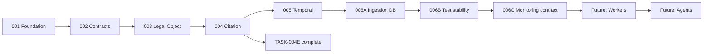

# Implementation Roadmap

**Authoritative implementation sequencing** (TASK-DOC-001).  
Statuses are **mutually exclusive** — each task appears in exactly one section.

For high-level status, see [CURRENT_STATUS.md](CURRENT_STATUS.md).  
For phase context, see [ARCHITECTURE_PHASE_MAP.md](ARCHITECTURE_PHASE_MAP.md).

**Last realigned:** 2026-06-02

---

## Sequencing correction: TASK-006B

| | |
|--|--|
| **Superseded (do not execute)** | Roadmap draft: *TASK-006B — Source Monitoring Agent Contract* |
| **Current approved TASK-006B** | **Test Isolation & Full-Suite Stability** |
| **Reason** | TASK-006A exposed migration/persistence complexity and **TEST-GAP-001** (full-suite instability). Test foundation must be trustworthy before agents, workers, or further migrations. |

Agent/monitoring contracts remain **FUTURE**, not current 006B.

---

## COMPLETE

Foundation and registry (TASK-001 and subtasks 001A–001P): runtime, models, migrations, CRUD, storage, upload, `ingestion_status` workflow, processing jobs, worker contract/no-op harness.

Extraction and structure contracts (TASK-002A–002F): extraction, segmentation, legal object extraction, citation anchors, cross-reference detection, structural parser.

Legal object path (TASK-002G–002I, 003A–003E): structural extraction, convergence, planning, schema, ORM, migration, repository, integrity.

Citation path (TASK-004A–004D, 004D-AMENDMENT-A): retrieval, effective-date resolver, citation candidates, citation assembly with version-pinned identity.

Temporal governance (TASK-005A-SPEC, 005B, 005C): `TEMPORAL_VERSIONING_ARCHITECTURE.md`, Addendum V6 alignment, pre-merge cleanup (005C).

Ingestion persistence (TASK-006A): `extraction_runs`, `extracted_texts`, `parser_runs`, `parsed_structures`, `ingestion_state_transitions`; `backend/app/services/ingestion/`; Alembic `c9a2f3b81d06`.

Documentation merge (TASK-005A merge governance): `MERGE_SUMMARY_TASK-005A.md`, checkpoint `checkpoint-task-005a-spec`.

Test hardening (TASK-006B): fixture isolation hardening, test DB safety guards, full-suite repeatability restored.

Monitoring governance contract (TASK-006C): bounded source monitoring contract with explicit no-live-agent boundaries.

Monitoring candidate persistence (TASK-006D): durable allowlist/attempt/event/candidate/state-transition records; no live monitoring automation.

Monitoring worker skeleton (TASK-006E): dry-run worker lifecycle orchestration using synthetic provider output only.

Controlled source fetch contract (TASK-006F): bounded fetch governance, taxonomy, and safety doctrine without live implementation.

Source change detection contract (TASK-006G): bounded detection governance and classification doctrine without engine implementation.

Controlled fetch implementation (TASK-006H): dry-run/local-fixture fetch execution, fixture safety boundaries, checksum/content-type validation, and no external network access.

Controlled fetch persistence (TASK-006I): append-only fetch request/result persistence with actor/reason metadata, status/error taxonomy validation, and no external network access.

Source change detection persistence (TASK-006J): append-only change-detection request/result persistence with review-required doctrine enforcement and no engine implementation.

Source change detection engine skeleton (TASK-006K): checksum-only comparison over persisted fetch results with bounded outcome classification and persistence integration.

Controlled source version promotion workflow (TASK-006L): explicit review-gated promotion from reviewed acquisition artifacts into canonical `source_versions` with append-only promotion history.

Source-version extraction trigger contract (TASK-006M): governance-only extraction-trigger boundary for eligibility, idempotency, rerun/force doctrine, and audited handoff semantics.

Extraction trigger persistence (TASK-006N): append-only extraction-trigger request/result persistence with deterministic trigger hashes, duplicate protection, and force-reprocess bypass auditability.

Extraction worker skeleton (TASK-006O): dry-run-only orchestration from extraction trigger requests to extraction_run lifecycle records with idempotency and force-reprocess paths.

Controlled extraction execution (TASK-006P): controlled local text extraction from approved artifacts into extraction_runs and extracted_texts with safety guards and no downstream legal-memory automation.

Extraction replay idempotency hardening (TASK-006P1): canonical source_version_id idempotency, DB partial unique index, worker replay guard; EXT-01/OD-019 remediated.

Parsing trigger contract (TASK-006Q): governance-only parsing initiation from `extracted_text`; canonical `extracted_text_id` idempotency doctrine; `parsed_structure` ≠ legal meaning; no parsing execution.

Parsing trigger persistence (TASK-006R): append-only `parsing_trigger_requests` / `parsing_trigger_results`, deterministic trigger hash, partial unique DB index on `extracted_text_id` WHERE `force_reparse = false`; no parser execution.

Parsing worker skeleton (TASK-006S): dry-run-only orchestration from parsing triggers to `parser_run` lifecycle; no `parsed_structure`/legal object/citation/answer.

Controlled parsing execution (TASK-006T): structural segmentation from `extracted_text` into `parsed_structures`; deterministic structure hash; no legal interpretation.

Parsed structure identity hardening (TASK-006T1A): `UNIQUE(parsed_structures.parser_run_id)`; P-01/P-02 closed; legal-object promotion gate opened after Claude verification.

Legal object promotion (TASK-006U–006X): contract through controlled execution; first canonical legal memory; `parsed_structure` ≠ legal meaning; no citations/answers.

---

## CITATION LAYER — CLOSED

Claude review **CLOSED** — **APPROVED FOR CONTINUE** ([`CLAUDE_REVIEW_CITATION_PIPELINE_006Y-006AD.md`](CLAUDE_REVIEW_CITATION_PIPELINE_006Y-006AD.md)). Checkpoint: `checkpoint-task-006y-006ad-citation-pipeline-review`.

| Task | Title | Status |
|------|-------|--------|
| TASK-006Y | Citation governance contract | Complete |
| TASK-006Z / 006ZA | Citation persistence | Complete |
| TASK-006AB | Citation worker skeleton | Complete |
| TASK-004E / 006AC / 006AC1 | Temporal + execution remediation | Complete |
| TASK-006AD | Controlled citation execution | Complete — 703 tests |

---

## APPROVED NEXT

| Task | Title | Prerequisite | Acceptance focus |
|------|-------|--------------|------------------|
| **TASK-007A** | Retrieval Runtime Pre-Authorization Review | Citation layer closed | **Complete** — APPROVED WITH REQUIRED REMEDIATION BEFORE 007B |
| **TASK-007A1** | Retrieval Runtime Remediation Package | TASK-007A | **Complete** — acceptance closed |
| **TASK-007B** | Retrieval Runtime Contract | 007A1 acceptance | **Complete** — governance only |
| **TASK-007C1** | Retrieval Persistence Remediation Package | TASK-007B + 007C pre-auth | **Complete** — acceptance closed |
| **TASK-007C** | Retrieval Persistence | 007C1 acceptance | **Complete** — append-only; 744 tests |
| **TASK-007D** | Retrieval Worker Skeleton | TASK-007C | **Complete** — dry-run only; 759 tests |
| **TASK-007D1** | Retrieval Execution Remediation | TASK-007D | **Planned** — before controlled execution |

**Retrieval layer pipeline:** 007A → 007A1 → 007B contract → 007C persistence → 007D dry-run skeleton → **007D1** → controlled execution → layer review.

**Next gate:** **TASK-007D1** — retrieval execution remediation (controlled execution not authorized).

**Not authorized:** controlled retrieval execution, ranking, answers, AI retrieval, concurrent workers.

**Blocked until governed approval:** retrieval implementation, answer runtime, live monitoring agents, ingestion automation expansion.

---

## RECENTLY COMPLETED (remediation)

| Task | Title | Notes |
|------|-------|-------|
| **TASK-004E** | Citation Temporal Compliance Remediation | AC-01 closed; OD-016 resolved |
| **TASK-006AC1** | Citation Execution Remediation Package | AC-02/AC-03 spec remediated; [spec](CITATION_EXECUTION_REMEDIATION_006AC1.md) |

Non-task deferred items: OD-017 (003E reconciliation), OD-018 (overlap disclosure) — governance review, not implementation queue.

---

## FUTURE

Not approved for immediate implementation. Order is indicative only; each requires a bounded task and review.

| Phase | Representative work | Depends on |
|-------|---------------------|------------|
| Ingestion automation | Wire workers to TASK-006A persistence; processing → extract → parse | TASK-006B |
| Controlled source fetch implementation | Implement fetch mechanics under 006F governance constraints | TASK-006F |
| Change detection engine implementation | Deterministic diff/checksum change classification under 006G doctrine | TASK-006G + controlled fetch implementation |
| Agent layer | Implement monitoring agents from 006C/006D/006E boundaries | Stable tests + fetch discipline + ingestion wiring |
| Cross-reference persistence | OD-007, OD-008 | Governance decisions |
| Retrieval layer expansion | Beyond 004A contract scope | Temporal + citation baseline |
| Answer assembly | Answer engine, disclosure, ranking | Retrieval + temporal + citation compliance |

Explicitly **out of roadmap until governed:** embeddings, vector DB, OCR, AI interpretation, Rwanda-specific ingestion logic, public production cutover.

---

## Dependency sketch

---

## How to use this document

1. Pick work only from **APPROVED NEXT** unless explicitly re-approved.
2. Move tasks **COMPLETE →** only after merge acceptance and registry update.
3. Record deferrals in **DEFERRED** and `OPEN_DECISIONS.md`, not by leaving tasks in APPROVED NEXT.
4. Do not resurrect superseded TASK-006B (Source Monitoring Agent) as current 006B.
